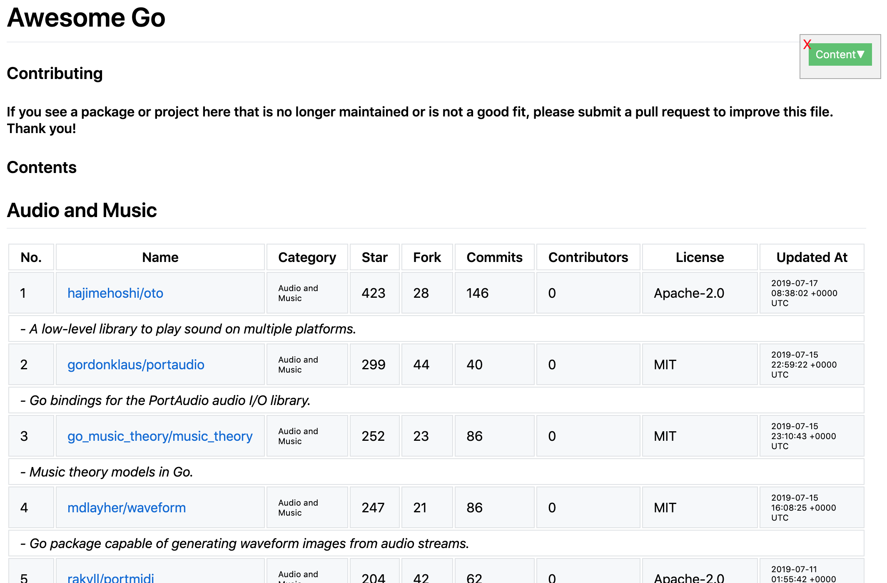

# awesome-tool

[](https://travis-ci.com/hedzr/awesome-tool)

`awesome-tool` is an command-line tool to retrieve the stars of all repos in an awesome-list (such as [awesome-go](https://github.com/avelino/awesome-go).


## Usage

```bash
awesome-tool build one \
    --name=awesome-go \
    --source=https://github.com/avelino/awesome-go \
    --work-dir=./output
```

<!-- TODO

```bash
awesome-tool build all \
    --name=awesome \
    --topic=https://github.com/topics/awesome \
    --work-dir=./output
```

-->


### Result

The results is an markdown file `output/awesome-xxx/output.md`, its preview looks like:




### Github name and passwd

As running `awesome-tool`, it'll ask for your github account name and password to authorize an access token for Github API. The name and password will be destroy after the token got. But your token will be saved into `$HOME/.asg.stats.token` for the next time, you could always erase the file safely.

The access token is used to request [Github API v3](https://developer.github.com/v3/) and [v4](https://developer.github.com/v4/).


### Contributors is 0 now

We can't query how many contributors via GitHub API v4, currently.

For saving your querying bandwidth, we ignore this count.
 

## LICENSE

MIT
